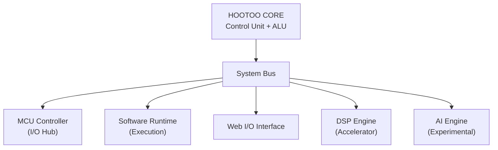

Hi, please refer to the documentation below for details on the latest version of the HooToo SoC :) 


## Core Specifications
- **Name:** Tu (Hoang Tu) / HooToo
- **Architecture:** Embedded Systems / Computer Engineering
- **Factory:** VNU - University of Science
- **Status:** Active | Learning | Debugging life

---

## MCU Controller (I/O Hub)
- Embedded Systems  
- Microcontrollers (MCU)  
- Hardware Design
- SoC
- Verilog *(basic proficiency)*  

---

## Software Runtime (Execution Engine)
- C / C++ (primary execution layer)
- Python (scripting and automation)
- Data Structures & Algorithms  
  *(Can play Codeforces but still improving problem-solving performance, benchmark data are stored here: https://codeforces.com/profile/HuTa)*

---

## Web I/O Interface
- HTML / CSS / JavaScript  
- Basic frontend development  
- Backend exploration *(in progress)*

---

## DSP Engine (Accelerator)
- Digital Signal Processing  
- Algorithm implementation and optimization  

---

## AI Engine (Experimental)
- Introductory exploration of Embedded AI  
- Planned future specialization  

---

## Debug & Communication Interface
- Email: **hoangtu91003@gmail.com**
- Known Issues: under investigation  
- Version: v2.0 (iterative updates)

---

## System Loop
```c
while (system_active) {
    learn();
    build();
    test();
    debug();
    optimize();
}
